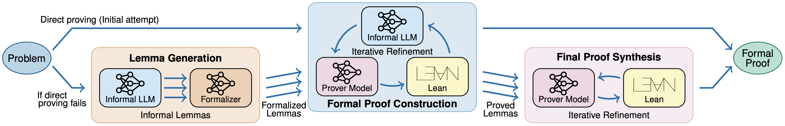
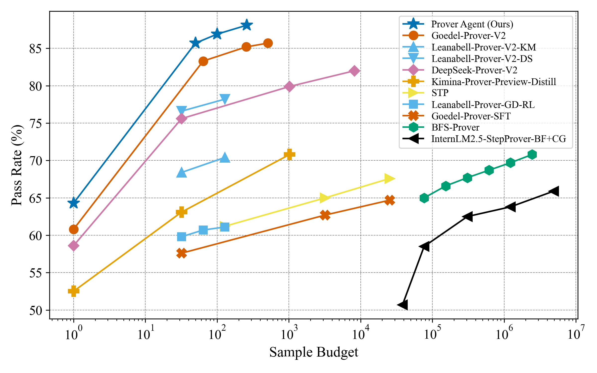

<p align="center">
  <a href="https://github.com/kAIto47802/Prover-Agent">
    
  </a>
</p>

<h1 align="center">
  <a href="https://github.com/kAIto47802/Prover-Agent">
    
  </a>
  Prover Agent: An Agent-Based Framework for Formal Mathematical Proofs
  <a href="https://github.com/kAIto47802/Prover-Agent">
    
  </a>
</h1>

<p align="center">
  Kaito Baba &emsp; Chaoran Liu &emsp; Shuhei Kurita &emsp; Akiyoshi Sannai
</p>

<p align="center">
  We present Prover Agent, a novel AI agent for automated theorem proving that integrates large language models (LLMs) with a formal proof assistant, Lean. Prover Agent coordinates an informal reasoning LLM, a formal prover model, and feedback from Lean while also generating auxiliary lemmas. These auxiliary lemmas are not limited to subgoals in the formal proof but can also include special cases or potentially useful facts derived from the assumptions, which help in discovering a viable proof strategy. It achieves an 88.1% success rate on the MiniF2F benchmark, establishing a new state-of-the-art among methods using small language models (SLMs) with a much lower sample budget than previous approaches. We also present theoretical analyses and case studies that illustrate how these generated lemmas contribute to solving challenging problems.
</p>

<br />

<div  align="center">
  <a href="https://www.python.org">
    
  </a>
</div>

<div  align="center">
  <a href="https://github.com/kAIto47802/Prover-Agent/blob/main/docs/icml2025_workshop_ai4math">
    
  </a>
</div>
<div  align="center">
  <a href="http://arxiv.org/abs/2506.19923">
    
  </a>
</div>

<br />

<p align="center">
  <a href="https://github.com/kAIto47802/Prover-Agent">
    
  </a>
</p>
Figure 1: Comparison of theorem-proving performance on the MiniF2F benchmark (Zheng et al., 2022) among methods using SLMs. Prover Agent achieves a higher success rate with fewer sample budgets, establishing a new state-of-the-art at this scale.

<br />

<h2>
  <div>🚀 Quick Start</div>
  <a href="https://github.com/kAIto47802/Prover-Agent/blob/main/README.md">
    
  </a>
</h2>


### 1. Clone this repository

```bash
git clone https://github.com/kAIto47802/Prover-Agent.git
cd Prover-Agent
```

### 2. Set up the Lean 4 environment

1. Install Lean 4 by following the [official installation guide](https://lean-lang.org/install/).

2. Initialize the Lean workspace:

```bash
cd lean_workspace
lake exe cache get
lake update
lake build # Check that the environment is set up successfully
cd ..
```


### 3. Install Python dependencies

```bash
# "data" for dataset preparation and "server" for running the LLM servers
pip install -e '.[data,server]'
```

### 4. Prepare the MiniF2F dataset

```bash
python scripts/prepare_minif2f.py
```
This will create a `data/miniF2F/test.json` file containing the processed MiniF2F dataset.

### 5. Configure the LLM server for your environment

Modify `serve.sh` (for launching the vLLM server) and `server_config.yml` (for the LiteLLM proxy) according to your machine specifications.
The provided examples are configured for 8 × 40 GB A100 GPUs, which were used in our experiments.

### 6. Start the LLM servers and run Prover Agent on the MiniF2F benchmark

Run the following script, which is provided as `run_minif2f.sh`:

```bash
#!/bin/bash

# Start the vLLM server
./serve.sh &
sleep 180 # Wait for the server to be ready

# Start the LiteLLM proxy server
litellm --config server_config.yml &
sleep 10 # Wait for the server to be ready

# Run Prover Agent on the MiniF2F benchmark
python dispatch_benchmark.py \
  --benchmark miniF2F \
  --phase test \
  --num_workers 16 # Adjust according to your machine specifications
```

### 7. Check the results
The results will be saved in the `runs/` directory, which will be created automatically.


> [!IMPORTANT]
> We strongly recommend double-checking the resulting proofs manually to avoid potential errors that may not be caught by the program.

> [!NOTE]
> The formalizer model is not frequently used in the workflow, so separating its dispatch stage instead of deploying it throughout the entire workflow can help save computational resources and improve throughput. See the [usage guide](docs/usage_guide.md) for more information.

<h2>
  <div>🔖 Citation</div>
  <a href="https://github.com/kAIto47802/Prover-Agent/blob/main/README.md">
    
  </a>
</h2>

If you find Prover Agent useful in your research, please consider citing the following paper:

```bibtex
@article{baba2024proveragent,
  title={{Prover Agent}: An Agent-Based Framework for Formal Mathematical Proofs},
  author={Baba, Kaito and Liu, Chaoran and Kurita, Shuhei and Sannai, Akiyoshi},
  journal={arXiv preprint arXiv:2506.19923},
  year={2025},
}
```
